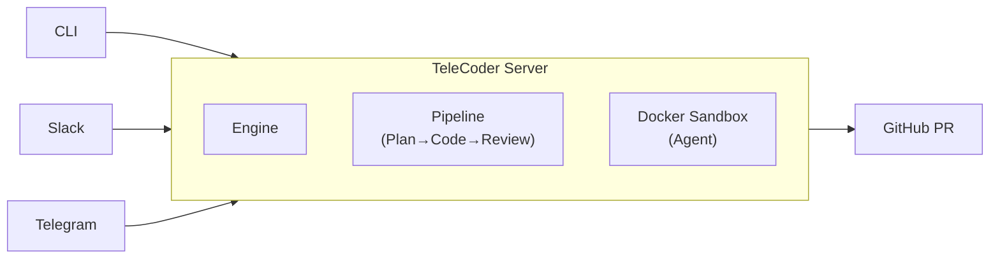

<div align="center">

# TeleCoder

**An extensible background coding agent framework for engineering teams.**

Send a task. Get a PR.

[](https://go.dev)
[](LICENSE)
[](https://docs.docker.com/get-docker/)

</div>

---

```
telecoderrun "add rate limiting to /api/users" --repo myorg/myapp
# ...agent works in background...
# -> PR #142 opened: https://github.com/myorg/myapp/pull/142
```

## How It Works

1. You send a task — via **CLI**, **Slack**, or **Telegram**
2. TeleCoder spins up an **isolated Docker sandbox** with your repo
3. A coding agent works on the task — [OpenCode](https://opencode.ai/) (Anthropic key) or [Codex](https://openai.com/index/codex/) (OpenAI key)
4. Changes are committed, pushed, and a **PR is opened**
5. You review the PR



## Framework

TeleCoder is designed as a **pluggable Go framework**. Import it as a library, swap any component via interfaces, and compose a custom application in ~15 lines.

### Minimal Usage

```go
package main

import (
    "context"
    telecoder "github.com/jxucoder/TeleCoder"
)

func main() {
    app, err := telecoder.NewBuilder().Build()
    if err != nil {
        panic(err)
    }
    app.Start(context.Background())
}
```

### Custom Usage

Swap out any component — store, sandbox, git provider, LLM, pipeline stages, channels:

```go
app, err := telecoder.NewBuilder().
    WithConfig(telecoder.Config{ServerAddr: ":8080", MaxRevisions: 2}).
    WithStore(myPostgresStore).
    WithGitProvider(myGitLabProvider).
    WithSandbox(myK8sRuntime).
    WithLLM(myLLMClient).
    WithChannel(myDiscordBot).
    Build()
```

### Core Interfaces

| Interface | Purpose | Built-in |
|:----------|:--------|:---------|
| `llm.Client` | LLM provider | Anthropic, OpenAI |
| `store.SessionStore` | Persistence | SQLite |
| `sandbox.Runtime` | Sandbox lifecycle | Docker |
| `gitprovider.Provider` | Git hosting | GitHub |
| `eventbus.Bus` | Real-time event pub/sub | In-memory |
| `pipeline.Stage` | Orchestration stages | Plan, Review, Decompose |
| `channel.Channel` | Input/output transport | Slack, Telegram |

## Quick Start

### Prerequisites

- [Go](https://go.dev/dl/) (version compatible with `go.mod`)
- [Docker](https://docs.docker.com/get-docker/)
- A GitHub personal access token ([create one](https://github.com/settings/tokens) with `repo` scope)
- An LLM API key — `ANTHROPIC_API_KEY` or `OPENAI_API_KEY`

### Install

```bash
go install github.com/jxucoder/TeleCoder/cmd/telecoder@latest
```

Or build from source:

```bash
git clone https://github.com/jxucoder/TeleCoder.git
cd TeleCoder
make build
```

### Setup

```bash
# Set required environment variables
export GITHUB_TOKEN="ghp_..."
export ANTHROPIC_API_KEY="sk-ant-..."   # or OPENAI_API_KEY

# Build the sandbox Docker image
make sandbox-image
```

### Run

```bash
# Start the server
telecoderserve

# In another terminal — run a task
telecoderrun "fix the typo in README.md" --repo yourorg/yourrepo

# List sessions
telecoderlist

# Check a session's status
telecoderstatus <session-id>

# Stream logs
telecoderlogs <session-id> --follow
```

### Docker Compose (fully containerized)

```bash
# Configure tokens
cp .env.example .env
# Edit .env with your tokens

# Start everything
make docker-up

# Run tasks against the server
telecoderrun "your task" --repo owner/repo --server http://localhost:7080
```

> See [docs/deploy.md](docs/deploy.md) for a full VPS deployment guide.

## Architecture

TeleCoder is a single binary — `telecoderserve` runs the server, `telecoderrun` talks to it. Every component is swappable via interfaces.

| Component | Package | Description |
|:----------|:--------|:------------|
| **Builder** | `telecoder` | Entry point. Composes all components via `NewBuilder().Build()`. |
| **Engine** | `engine/` | Session orchestration — creates sessions, manages sandbox lifecycle, runs review/revision loops. |
| **Pipeline** | `pipeline/` | Plan → code → review pipeline with optional task decomposition and configurable stages. |
| **HTTP API** | `httpapi/` | Chi router. REST API + SSE streaming. Delegates all logic to engine. |
| **Store** | `store/sqlite/` | SQLite persistence (WAL mode) for sessions, messages, events. |
| **Sandbox** | `sandbox/docker/` | One Docker container per task (or persistent container for chat mode). |
| **Git Provider** | `gitprovider/github/` | GitHub API — PR creation, repo indexing, webhook handling. |
| **Event Bus** | `eventbus/` | In-memory pub/sub for real-time SSE events. |
| **Channels** | `channel/slack/`, `channel/telegram/` | Bot integrations — send tasks from chat, get PR links back. |
| **CLI** | `cmd/telecoder/` | Reference implementation. Creates sessions, streams logs, checks status. |
| **Web UI** | `web/` | React + Vite dashboard for monitoring sessions. |

### API

| Method | Endpoint | Description |
|:-------|:---------|:------------|
| `POST` | `/api/sessions` | Create a session (`mode=task` or `mode=chat`) |
| `GET` | `/api/sessions` | List sessions |
| `GET` | `/api/sessions/:id` | Get session details |
| `GET` | `/api/sessions/:id/events` | SSE stream of events |
| `GET` | `/api/sessions/:id/messages` | List chat messages |
| `POST` | `/api/sessions/:id/messages` | Send chat message |
| `POST` | `/api/sessions/:id/pr` | Create PR from chat session |
| `POST` | `/api/sessions/:id/stop` | Stop a session |
| `GET` | `/health` | Health check |

## Configuration

All configuration is via environment variables:

| Variable | Required | Default | Description |
|:---------|:---------|:--------|:------------|
| `GITHUB_TOKEN` | Yes | — | GitHub personal access token |
| `ANTHROPIC_API_KEY` | One of these | — | Anthropic API key |
| `OPENAI_API_KEY` | One of these | — | OpenAI API key |
| `TELECODER_ADDR` | No | `:7080` | Server listen address |
| `TELECODER_DATA_DIR` | No | `~/.telecoder` | Data directory for SQLite DB |
| `TELECODER_DOCKER_IMAGE` | No | `telecoder-sandbox` | Sandbox Docker image |
| `TELECODER_DOCKER_NETWORK` | No | `telecoder-net` | Docker network name |
| `TELECODER_MAX_REVISIONS` | No | `1` | Max review/revision rounds per sub-task |
| `TELECODER_CHAT_IDLE_TIMEOUT` | No | `30m` | Idle timeout for persistent chat sandboxes |
| `TELECODER_CHAT_MAX_MESSAGES` | No | `50` | Max user messages per chat session |
| `TELECODER_PLANNER_MODEL` | No | — | Override LLM model for pipeline stages |
| `TELECODER_SERVER` | No | `http://localhost:7080` | Server URL (for CLI) |

## Project Structure

```
TeleCoder/
├── telecoder.go              Builder, App, Config — top-level framework entry point
├── defaults.go               Default wiring logic for Build()
├── model/                    Foundation types (Session, Message, Event)
├── llm/                      LLM Client interface
│   ├── anthropic/            Anthropic implementation
│   └── openai/               OpenAI implementation
├── store/                    SessionStore interface
│   └── sqlite/               SQLite implementation
├── sandbox/                  Runtime interface
│   └── docker/               Docker implementation
├── gitprovider/              Provider interface
│   └── github/               GitHub implementation (client, indexer, webhook)
├── eventbus/                 Bus interface + InMemoryBus
├── pipeline/                 Stage/Pipeline interfaces + built-in stages
├── engine/                   Session orchestration logic
├── httpapi/                  HTTP API handler (chi router, SSE)
├── channel/                  Channel interface
│   ├── slack/                Slack bot (Socket Mode)
│   └── telegram/             Telegram bot (long polling)
├── cmd/telecoder/               Reference CLI implementation
├── web/                      React + Vite dashboard
├── docker/
│   ├── base.Dockerfile       Sandbox image (Ubuntu + Node + Python + Go + agents)
│   ├── server.Dockerfile     Server image (minimal Alpine)
│   ├── compose.yml           Docker Compose for local dev
│   ├── entrypoint.sh         Sandbox entrypoint script
│   └── setup.sh              Sandbox setup script
├── _examples/minimal/        Minimal framework usage example
└── docs/                     Deployment & setup guides
```

## Roadmap

### Phase 1 — MVP

- [x] Server with REST API and SSE streaming
- [x] Docker sandbox with pluggable agents (OpenCode, Codex)
- [x] CLI (`run`, `list`, `status`, `logs`)
- [x] GitHub PR creation
- [x] Slack bot integration
- [x] Telegram bot integration
- [x] Web UI (React + Vite)

### Phase 2 — Intelligence

- [x] Plan-then-code-then-review prompt chain
- [x] Repo-aware context indexing
- [x] Multi-step task decomposition
- [x] Review-revision loop with configurable max rounds

### Phase 3 — Extensible Framework

- [x] Interface-based architecture with 7 pluggable components
- [x] Builder API for composing custom applications
- [x] Extracted engine, pipeline, HTTP API into independent packages
- [x] Framework importable as a Go library

### Phase 4 — Scale

- [ ] Sandbox pre-warming and caching
- [ ] Modal / cloud sandbox provider
- [ ] Multiplayer sessions
- [ ] Kubernetes Helm chart

## Documentation

| Guide | Description |
|:------|:------------|
| [Getting Started](docs/getting-started.md) | First-time setup walkthrough |
| [Deployment](docs/deploy.md) | VPS deployment with Docker Compose |
| [Slack Setup](docs/slack-setup.md) | Connect your Slack workspace |
| [Telegram Setup](docs/telegram-setup.md) | Set up the Telegram bot |

## License

Apache 2.0 — see [LICENSE](LICENSE).
