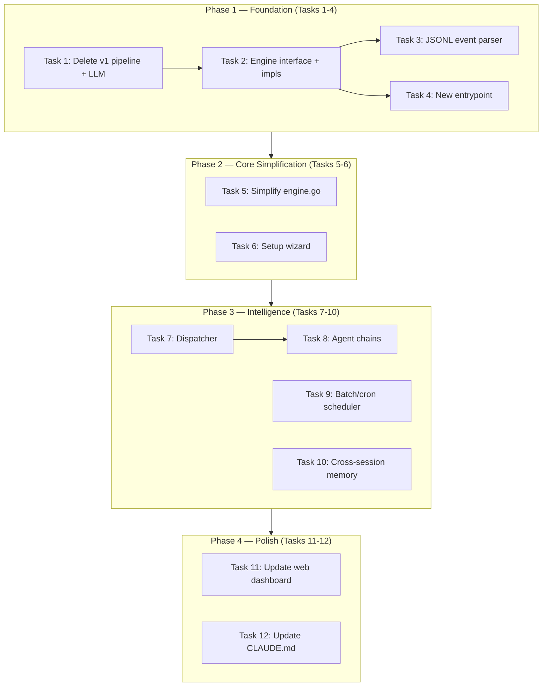

# TeleCoder v2 Roadmap

> **Date:** 2026-02-17
> **POC:** @jxucoder
> **Status:** Complete ✅

## TL;DR

TeleCoder v2 replaces the built-in LLM pipeline with a pluggable coding-engine abstraction, adds an LLM-powered dispatcher for intelligent event routing, and introduces agent chains, cross-session memory, and batch/cron scheduling. The migration is broken into 4 phases across 12 tasks — each task has a concrete eval so progress is binary.

---

## Current State (v1)

| Component | Package | Status |
|:----------|:--------|:-------|
| LLM clients (Anthropic, OpenAI) | `pkg/llm/` | ✅ Implemented — **to be deleted** |
| Pipeline (plan → code → review → verify) | `pkg/pipeline/` | ✅ Implemented — **to be deleted** |
| Session orchestration | `internal/engine/` | ✅ Implemented — **to be refactored** |
| Docker sandbox | `pkg/sandbox/` | ✅ Implemented |
| SQLite store | `pkg/store/` | ✅ Implemented |
| Event bus | `pkg/eventbus/` | ✅ Implemented |
| GitHub git provider | `pkg/gitprovider/` | ✅ Implemented (includes `indexer.go` — **to be deleted**) |
| Channels (Slack, Telegram, Linear, Jira, GitHub) | `pkg/channel/` | ✅ Implemented |
| HTTP API + SSE | `internal/httpapi/` | ✅ Implemented |
| CLI (serve, run, list, status, config) | `cmd/telecoder/` | ✅ Implemented |
| Web dashboard | `web/` | ✅ Implemented |
| Docker entrypoint | `docker/entrypoint.sh` | ✅ Implemented — **to be replaced** |

### What v1 Does Well
- End-to-end flow works: CLI → server → sandbox → PR
- Chat mode with persistent containers
- Multi-step task decomposition with checkpoints
- PR comment sessions (respond to reviewer feedback)
- Multiple channels (Slack, Telegram, Linear, Jira)

### What v2 Changes
- **Delete** `pkg/llm/` and `pkg/pipeline/` (~1,500 lines) — coding engines handle LLM calls internally
- **Add** `pkg/agent/` — pluggable engine interface (Pi, Claude Code, OpenCode, Codex)
- **Add** `pkg/dispatcher/` — LLM-powered event routing replaces keyword matching
- **Add** `pkg/memory/` — cross-session vector store (sqlite-vec)
- **Add** `pkg/scheduler/` — batch/cron jobs
- **Simplify** `internal/engine/` — remove decompose/plan/review/revision loop

---

## Phase Map



---

## Phase 1 — Foundation

> **Goal:** Replace v1 pipeline/LLM with pluggable engine abstraction. No backward compatibility.

### Task 1: Delete v1 Pipeline and LLM Packages

| Field | Value |
|:------|:------|
| **Priority** | P0 — blocker for all other tasks |
| **Estimate** | 0.5 day |
| **Status** | ✅ Complete |
| **Dependencies** | None |

**Scope:**
- Delete `pkg/llm/` (entire directory)
- Delete `pkg/pipeline/prompts.go`
- Delete `pkg/gitprovider/github/indexer.go`
- Move `SubTaskStatus` + progress helpers from `pkg/pipeline/pipeline.go` → `pkg/model/`
- Move `verify.go` → `pkg/sandbox/verify.go`
- Delete remainder of `pkg/pipeline/`
- Remove all pipeline/LLM references from `telecoder.go`, `internal/engine/engine.go`, Builder/Config

**Eval:**
- [ ] `go build ./...` succeeds
- [ ] `go test ./...` passes (update/remove tests that depend on deleted code)
- [ ] No import of `pkg/llm` or `pkg/pipeline` anywhere

---

### Task 2: Engine Interface and Implementations

| Field | Value |
|:------|:------|
| **Priority** | P0 — core abstraction |
| **Estimate** | 1 day |
| **Status** | ✅ Complete |
| **Dependencies** | Task 1 |

**Scope:**
- Create `pkg/agent/` with `Engine` interface:
  ```go
  type Engine interface {
      Name() string
      Command(prompt string) string
      ParseEvent(line string) *model.Event
  }
  ```
- Implement for Pi, Claude Code, OpenCode, Codex (each ~50-100 lines)
- Update `internal/engine/engine.go` to use `Engine.Command()` instead of hardcoded `chatAgentCommand` switch
- Wire engine selection via config (`TELECODER_CODING_AGENT` env var)

**Eval:**
- [ ] `go test ./pkg/agent/...` — unit tests for each engine's `Command()` and `ParseEvent()` with sample output
- [ ] `engine.go` compiles with no direct references to "pi", "claude", "opencode", "codex" — only through the interface

---

### Task 3: JSONL Event Parser

| Field | Value |
|:------|:------|
| **Priority** | P0 |
| **Estimate** | 0.5 day |
| **Status** | ✅ Complete |
| **Dependencies** | Task 2 |

**Scope:**
- Replace `dispatchLogLine` (the `###TELECODER_` marker parser) with `Engine.ParseEvent()`
- Each engine normalizes its output format to TeleCoder's `model.Event`
- The entrypoint's final line (`{"telecoder":"done",...}`) is parsed as a completion event

**Eval:**
- [ ] Integration test — feed sample Pi JSONL transcript and Claude Code stream-json transcript through parser, verify events emitted correctly
- [ ] Feed old `###TELECODER_DONE###` format — verify it's no longer recognized (backward compat broken)

---

### Task 4: New Entrypoint

| Field | Value |
|:------|:------|
| **Priority** | P0 |
| **Estimate** | 0.5 day |
| **Status** | ✅ Complete |
| **Dependencies** | Task 2 |

**Scope:**
- Replace `docker/entrypoint.sh` with engine-aware version (case switch on `TELECODER_CODING_AGENT`)
- Delete old entrypoint

**Eval:**
- [ ] Build Docker image (`make sandbox-image`)
- [ ] Run entrypoint with `TELECODER_CODING_AGENT=pi` and mock prompt — verify it runs `pi -p "..." --mode json`
- [ ] Repeat for `claude-code`, `opencode`, `codex`

---

## Phase 2 — Core Simplification

> **Goal:** Gut the complex orchestration loop and add the interactive setup wizard.

### Task 5: Simplify engine.go

| Field | Value |
|:------|:------|
| **Priority** | P0 |
| **Estimate** | 1-2 days |
| **Status** | ✅ Complete |
| **Dependencies** | Tasks 1-4 |

**Scope:**
- Gut `runSubTask`, `runSandboxRound`, `runSandboxRoundWithAgent` (decompose/plan/review/revision loop)
- Replace with: start container → read stdout via `Engine.ParseEvent()` → on completion check for changes → commit/push → create PR
- **Keep:** `runVerify` (moved to sandbox), `MaxRevisions` as bounded retry for verify failures only, `runSessionMultiStep` simplified to sequential prompts, chat mode, `CreatePRFromChat`, `CreatePRCommentSession`, idle reaper

**Eval:**
- [ ] `go test ./internal/engine/...` passes
- [ ] E2E test (`e2e/e2e_test.go`) updated and passes — creates session, runs stub engine, gets result
- [ ] Session lifecycle: pending → running → complete works

---

### Task 6: Setup Wizard

| Field | Value |
|:------|:------|
| **Priority** | P1 |
| **Estimate** | 0.5 day |
| **Status** | ✅ Complete |
| **Dependencies** | Task 2 (needs engine list) |

**Scope:**
- Create `cmd/telecoder/setup.go` with interactive prompts using [huh](https://github.com/charmbracelet/huh):
  1. GitHub token (validate with API call)
  2. LLM API key (detect provider from key prefix)
  3. Engine selection (pi/claude-code/opencode/codex)
  4. Channels (Slack/Telegram/none)
  5. Docker check (`docker info`)
  6. Write `~/.telecoder/config.env`

**Eval:**
- [ ] `go build ./cmd/telecoder/` succeeds
- [ ] `telecoder setup --non-interactive --github-token=test --engine=pi` writes valid config file

---

## Phase 3 — Intelligence

> **Goal:** Add the smart routing, chaining, scheduling, and memory features that differentiate v2.

### Task 7: Dispatcher (LLM-Powered Routing)

| Field | Value |
|:------|:------|
| **Priority** | P1 |
| **Estimate** | 1-2 days |
| **Status** | ✅ Complete |
| **Dependencies** | Phase 2 complete |

**Scope:**
- Create `pkg/dispatcher/`
- Takes raw event text + channel metadata → calls lightweight LLM → returns `{action, repo, prompt, agent}`
- Channels call dispatcher instead of parsing keywords/labels directly
- System prompt per channel type

**Eval:**
- [ ] Unit test with mock LLM — 5 sample events (Slack task, Slack question, GitHub issue, Sentry alert, irrelevant message)
- [ ] Verify correct action for each
- [ ] `action: "ignore"` produces no session

---

### Task 8: Agent Chains

| Field | Value |
|:------|:------|
| **Priority** | P1 |
| **Estimate** | 1 day |
| **Status** | ✅ Complete |
| **Dependencies** | Task 7 |

**Scope:**
- After session completes, engine checks if result should trigger a follow-up
- Dispatcher evaluates result event → may spawn new session
- Chain depth limit (default 3) to prevent loops
- `chain_id` links related sessions

**Eval:**
- [ ] Integration test — session completes with `type: pr`, dispatcher called with completion event
- [ ] Mock dispatcher returns `action: spawn` → child session created with correct `chain_id`
- [ ] Chain depth 4 rejected

---

### Task 9: Batch/Cron Scheduler

| Field | Value |
|:------|:------|
| **Priority** | P2 |
| **Estimate** | 1 day |
| **Status** | ✅ Complete |
| **Dependencies** | Phase 2 complete |

**Scope:**
- Create `pkg/scheduler/`
- Read `.telecoder/jobs/*.yaml`, parse schedule (cron syntax), repos, prompts
- Use `robfig/cron` for scheduling
- Each trigger creates task-mode sessions via engine

**Eval:**
- [ ] Unit test — parse sample job YAML, verify schedule/repos/prompt extracted
- [ ] Integration test — register job with `@every 1s`, verify session created within 2 seconds

---

### Task 10: Cross-Session Memory

| Field | Value |
|:------|:------|
| **Priority** | P2 |
| **Estimate** | 1-2 days |
| **Status** | ✅ Complete |
| **Dependencies** | Phase 2 complete |

**Scope:**
- Create `pkg/memory/`
- SQLite with `sqlite-vec` for vector search
- After session completes → store summary embedding
- Before new session starts → retrieve top-3 relevant past sessions for same repo → inject as context

**Eval:**
- [ ] Unit test — store 10 summaries, query with related prompt, cosine similarity > 0.7
- [ ] Sessions from different repo not returned

---

## Phase 4 — Polish

> **Goal:** Update user-facing surfaces to reflect v2 architecture.

### Task 11: Update Web Dashboard

| Field | Value |
|:------|:------|
| **Priority** | P2 |
| **Estimate** | 1 day |
| **Status** | ✅ Complete |
| **Dependencies** | Phase 3 complete |

**Scope:**
- Show engine name per session
- Agent chain visualization (linked sessions)
- Batch job status
- Session event stream from new JSONL format

**Eval:**
- [ ] `cd web && npm run build` succeeds
- [ ] Manual verification — dashboard renders sessions with engine labels

---

### Task 12: Update CLAUDE.md / Docs

| Field | Value |
|:------|:------|
| **Priority** | P2 |
| **Estimate** | 0.5 day |
| **Status** | ✅ Complete |
| **Dependencies** | All other tasks complete |

**Scope:**
- Rewrite project docs to match v2 architecture
- Remove references to `pkg/llm/`, `pkg/pipeline/`, old marker protocol
- Add `pkg/agent/`, `pkg/dispatcher/`, `pkg/memory/`, `pkg/scheduler/`

**Eval:**
- [ ] Every package mentioned in docs exists
- [ ] Every deleted package is not mentioned

---

## Timeline Summary

| Phase | Tasks | Estimated Duration | Target |
|:------|:------|:-------------------|:-------|
| **Phase 1 — Foundation** | 1, 2, 3, 4 | 2-3 days | Week 1 |
| **Phase 2 — Core Simplification** | 5, 6 | 1.5-2.5 days | Week 1-2 |
| **Phase 3 — Intelligence** | 7, 8, 9, 10 | 4-6 days | Week 2-3 |
| **Phase 4 — Polish** | 11, 12 | 1.5 days | Week 3-4 |
| **Total** | 12 tasks | ~9-14 days | 3-4 weeks |

---

## Dependency Graph (Critical Path)

```
Task 1 → Task 2 → Task 3 → Task 5 → Task 7 → Task 8
                 → Task 4 ↗        → Task 9
                                    → Task 10
                 → Task 6           → Task 11 → Task 12
```

**Critical path:** T1 → T2 → T3 → T5 → T7 → T8 → T11 → T12

Tasks 3 & 4 can be done in parallel (both depend only on Task 2).
Tasks 9 & 10 can be done in parallel with Tasks 7 & 8 (all depend on Phase 2).

---

## Open Questions

| # | Question | Impact | Status |
|:--|:---------|:-------|:-------|
| 1 | Use Rivet's Sandbox Agent SDK instead of own engine abstraction? | Could save Task 2 effort, but adds external dependency | 🔲 Decide before Task 2 |
| 2 | Dispatcher model: small (Haiku, GPT-4o-mini) vs configurable? | Cost vs flexibility | 🔲 Decide before Task 7 |
| 3 | Loop prevention: how does the dispatcher know when a chain is done? | Correctness of agent chains | 🔲 Decide before Task 8 |
| 4 | Memory scope: per-repo or per-team? | Privacy implications for cross-repo | 🔲 Decide before Task 10 |
| 5 | Per-engine slim Docker images vs one fat image? | Build time, image size vs simplicity | 🔲 Decide before Task 4 |

---

## Risk Register

| Risk | Likelihood | Impact | Mitigation |
|:-----|:-----------|:-------|:-----------|
| Engine output format changes upstream | Medium | High | Pin versions, add format versioning in `ParseEvent()` |
| sqlite-vec unavailable or unstable | Low | Medium | Fall back to brute-force cosine similarity on small dataset |
| Dispatcher hallucinations (wrong routing) | Medium | Medium | Conservative system prompts, `action: ignore` as default, human override channel |
| Chain infinite loops | Low | High | Hard depth limit (default 3), session dedup by prompt hash |
| Breaking change in huh (TUI library) | Low | Low | Pin version, setup wizard is non-critical path |
